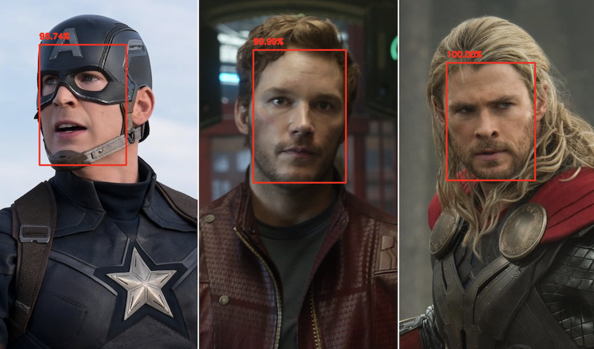

## Face detection using OpenCV and Deep Neural Network

### installation (for ubuntu)

cd libraries

pip3 install opencv_python-4.5.5.64-cp39-cp39-linux_armv7l.whl
(other version may has error for this code)




### How to run?

To use in an image:
```console
$ python detect_faces.py --image group.jpg --prototxt deploy.prototxt.txt --model \
res10_300x300_ssd_iter_140000.caffemodel
```

To use in webcam:
```console
$ python detect_faces_video.py --prototxt deploy.prototxt.txt --model \
res10_300x300_ssd_iter_140000.caffemodel
```
